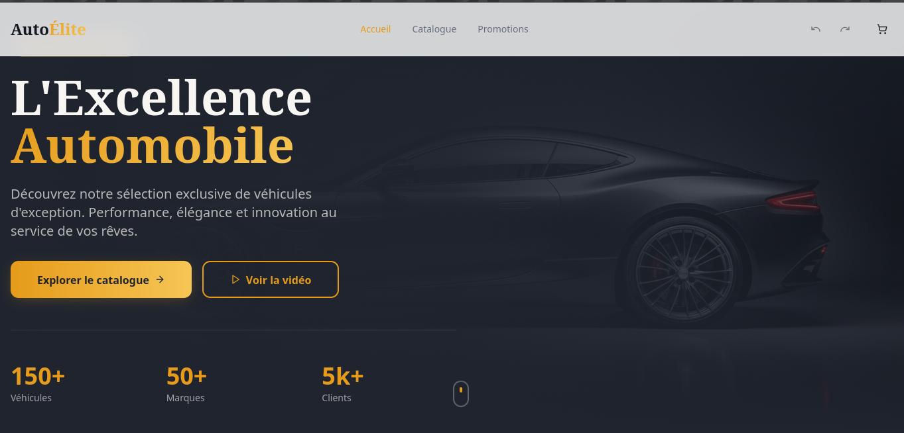
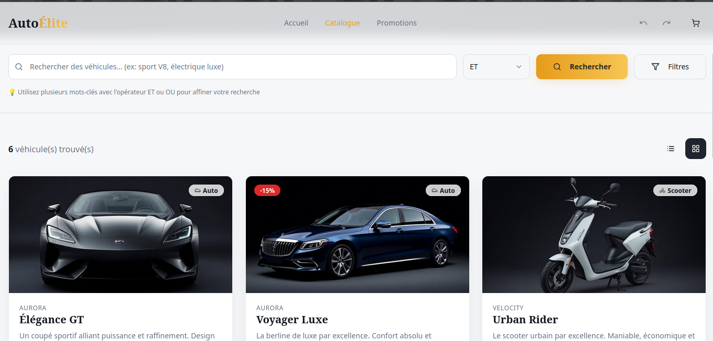
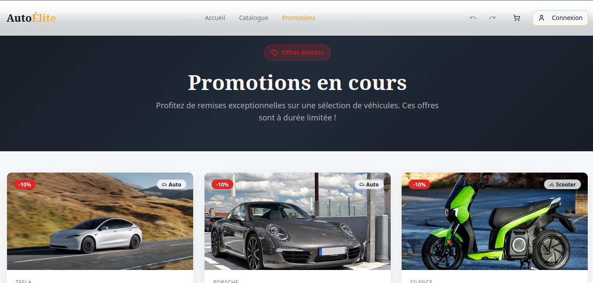
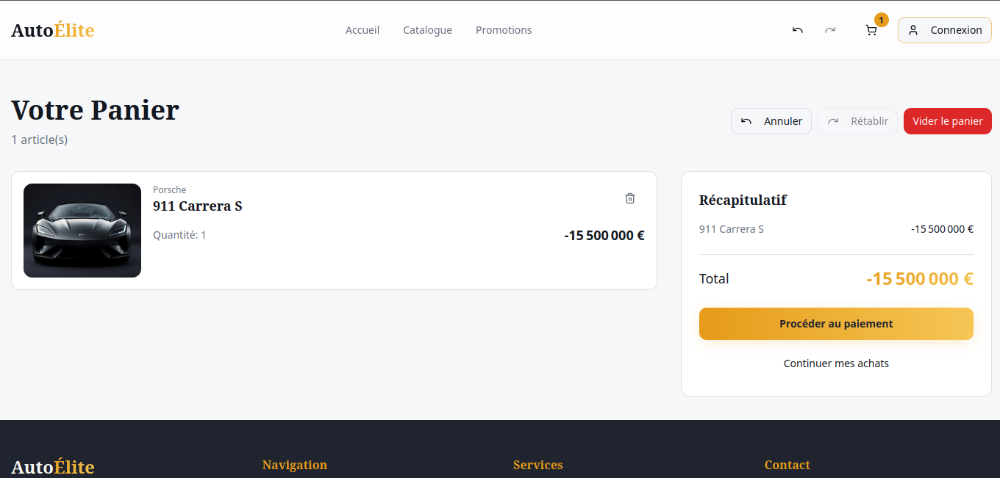
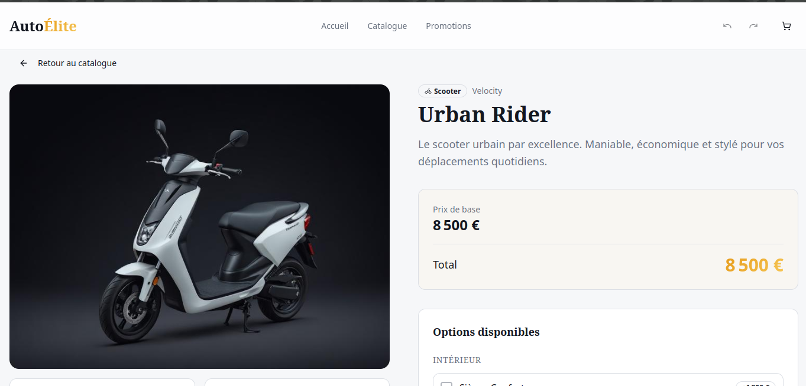

# AutoElite - Application de Vente de Véhicules en Ligne

Ce projet est une application web de vente de véhicules en ligne, conçue pour illustrer l'utilisation de divers patrons de conception (Design Patterns) dans une architecture moderne.

## Objectif du Projet

L'objectif principal de ce projet est de servir de démonstration pratique pour l'implémentation de patrons de conception GoF (Gang of Four) dans une application réelle. Chaque patron est utilisé pour résoudre un problème de conception spécifique au sein de l'API backend.

## Architecture de Développement

L'application suit une architecture découplée  3-Tiers, composée de :

- **Un Backend API RESTful (`VehiClub-API`)**: Développé avec **Java/Spring Boot**, il expose des endpoints REST pour toutes les opérations métier. Cette approche le rend agnostique à la technologie du client.
- **Un Frontend Single Page Application (SPA) (`VehiClub-View`)**: Développé avec **React/TypeScript**, il offre une expérience utilisateur riche et dynamique en consommant les données de l'API backend.
- **Une Base de Données Relationnelle**: **PostgreSQL** est utilisé pour la persistance des données.
- **Un Environnement Containerisé**: **Docker** et **Docker Compose** sont utilisés pour gérer la base de données, assurant un environnement de développement cohérent et facile à mettre en place.


## Stack Technologique

*   **Backend**: Java 17, Spring Boot, Maven
*   **Frontend**: React, TypeScript, Vite
*   **Base de Données**: PostgreSQL
*   **Containerisation**: Docker, Docker Compose

## Lancement rapide du Projet

Pour démarrer rapidement le projet, suivez ces étapes :

1.  **Cloner le dépôt avec ses sous-modules :**
    ```bash
    git clone --recurse-submodules https://github.com/JordanFotso/AutoElite.git
    cd AutoElite
    ```

2.  **Démarrer la base de données (PostgreSQL avec Docker Compose) :**
    À la racine du projet, exécutez la commande suivante pour démarrer le conteneur PostgreSQL en arrière-plan :
    ```bash
    docker-compose up -d
    ```

3.  **Lancer l'API Backend (VehiClub-API) :**
    Naviguez dans le répertoire de l'API, puis utilisez le wrapper Maven pour lancer l'application :
    ```bash
    cd VehiClub-API
    ./mvnw spring-boot:run
    ```

4.  **Lancer le Frontend (VehiClub-View) :**
    Naviguez dans le répertoire du frontend, installez les dépendances, puis lancez le serveur de développement :
    ```bash
    cd VehiClub-View
    npm i
    npm run dev
    ```

## Lancement du Projet

Pour lancer le projet, veuillez suivre les instructions détaillées dans les `README` de chaque sous-projet :

1.  **[Instructions pour le Backend (VehiClub-API)](VehiClub-API/README.md)**
2.  **[Instructions pour le Frontend (VehiClub-View)](VehiClub-View/README.md)**

## Aperçu de l'Application

Voici un aperçu de l'interface utilisateur cible.

### Page d'Accueil


### Catalogue


### Promotion


### Pannier


### Détail d'un Véhicule


